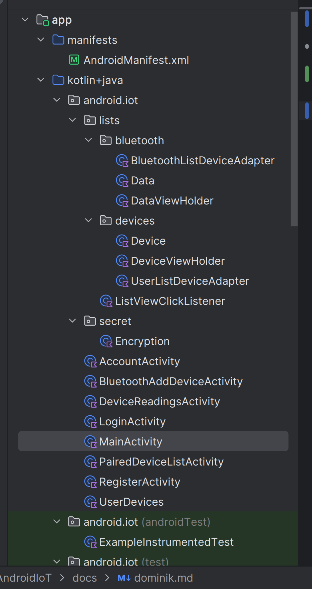
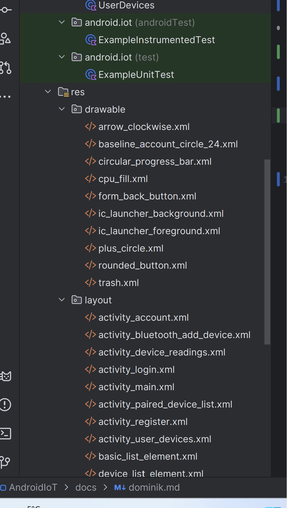
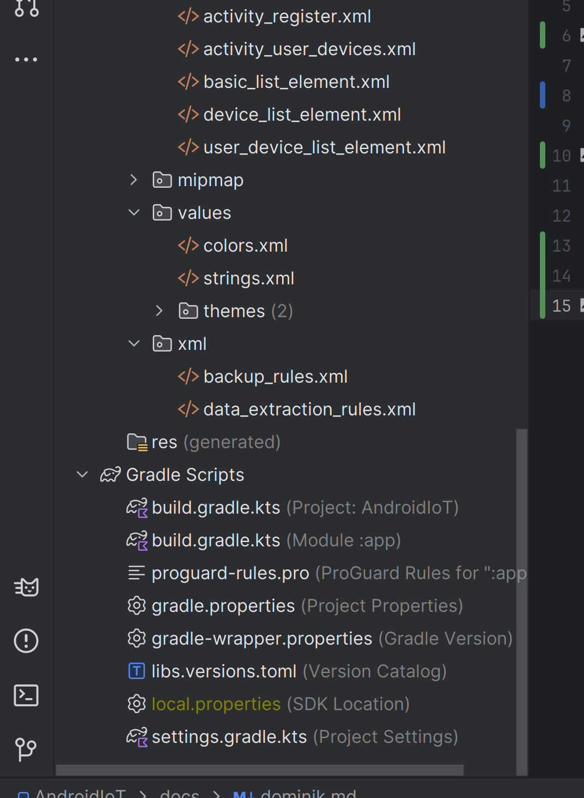

Notatki z części kodu aplikacji - łączenie się bleutooth z urządzeniem


Polecam pobrać sobie Android Studio, a nawet zainstalować sobie maszynę wirtualną. IDE powinno samo wykryć ustawienia i zainstalować sobie potrzebne SKD, ale jak nie to projekt używa:

```json
{
	"GradleVersion": "8.2.1",
	"Android studio": "Iguana",
	"Android SDK": "14 - \"Upside Down Cake\"",
	"ApiLevel": "34, revision 2",
	"Język": "Kotlin",
}
```

Json tylko aby to ładnie wyświetlić w Markdown, nie ma zastosowania w projekcie.

Polecam sobie na bierząco przeglądać te pliki co tutaj wymieniam. Nie będę się rozpisywał o każdym szczególe, bo to nie ma sensu. Wszystko jest opisane w dokumentacji Androida, a ja opiszę co jest ważne i co warto znać. Kod zawiera też komentarze.

#Struktura

Ponizej opiszę strukturę plików i folderów w aplikacji. Taki widok prezentuje się w Android Studio, ale nie fizycznie w ułożeniu folderów. Niemniej jednak




### Manifests
`AndroidManifest.xml` - plik do którego odwołuje się system Android. Zawiera informacje o aplikacji, takie jak nazwa, ikona, wersja, uprawnienia, itp. . Najwarzniejsze są chyba uprawnienia. Dodatkowo jakbyśmy chcieli tą apkę dać na Google Store to trzeby się szczegółowo zainteresować tym plikiem.

### Kotlin+Java

Tu znajduje się cały kod aplikacji, nasza używa w 100% kotlina. Opisz szczeółowy będzie w kolejnym rozdziale. Struktura plików:

- `android.iot` - główny folder aplikacji. Znajdują się tam wszyskie aktywności aplikacji.

- `android.iot.lists` - Folder z klasami, które są potrzebne, aby dynamicznie tworzyć listy (*RecyclerViewandroidx.recyclerview.widget.RecyclerView*).

- `android.iot.lists.bluetooth` - Klasy potrzebne do zarządzania listą w layoutcie *activity_paired_device_list.xml* . 


Tutaj są jeszcze testy, ale nie będę się nimi zajmował. (androidTest ....) W skrócie nie są zrobione, bo nie były wymagane





bbbbbb




cccc